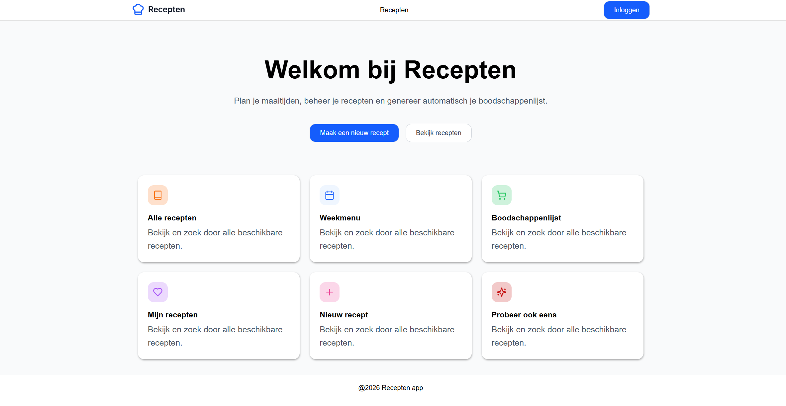

# Mijn Recepten

Met Mijn Recepten kun je makkelijk recepten aanmaken en beheren, ze toevoegen aan een weekmenu en dat menu vervolgens downloaden. Handig toch?

---

## Inhoudsopgave

1. [Inleiding](#1-inleiding)
2. [Screenshot](#2-screenshot)
3. [Benodigdheden](#3-benodigdheden)
4. [De applicatie draaien](#4-de-applicatie-draaien)
5. [Overige commando's](#5-overige-commandos)
6. [Testgebruikers](#6-testgebruikers)

---

## 1. Inleiding

**Mijn Recepten** is een React-app waarmee je:

- Recepten kunt aanmaken en beheren
- Recepten kunt toevoegen aan een weekmenu
- Je weekmenu kunt downloaden


---

## 2. Screenshot



---

## 3. Benodigdheden

Zorg dat je dit op je computer hebt staan:

- [Node.js](https://nodejs.org/) (v18 of hoger)
- npm (komt automatisch mee met Node.js)
- [Git](https://git-scm.com/)

Met deze commands kan je kijken of je de juiste versies hebt (geen specifieke versie vereist voor deze applicatie):

```bash
node -v
npm -v
```

---

## 4. De applicatie draaien

### Stap 1 – Repository klonen

```bash
git clone https://github.com/MarlenaXXVII/my-recipes.git
cd my-recipes
```

### Stap 2 – Afhankelijkheden installeren

```bash
npm install
```

### Stap 3 – App starten

```bash
npm run dev
```

### Stap 4 – Openen in je browser

Ga naar:

```
http://localhost:5173
```

---

## 5. Overige commando's

| Commando | Wat doet het?                 |
|----------|-------------------------------|
| `npm run dev` | Start de app lokaal           |
| `npm run build` | Maakt een productie build     |
| `npm run preview` | Bekijk de productie build     |
| `npm run lint` | Controleert de code op fouten |

---

## 6. Testgebruikers

Je kunt inloggen met de volgende testaccounts:

| Naam | E-mailadres | Wachtwoord | Rol |
|------|-------------|------------|-----|
| Admin | admin@voorbeeld.nl | admin123 | Admin |
| Gebruiker | gebruiker@voorbeeld.nl | gebruiker123 | User |
| Milan | milan@voorbeeld.nl | milan123 | User |
| Noor | noor@voorbeeld.nl | noor123 | User |

> ⚠️ Deze accounts zijn alleen bedoeld om de app te testen, niet voor productiegebruik.
